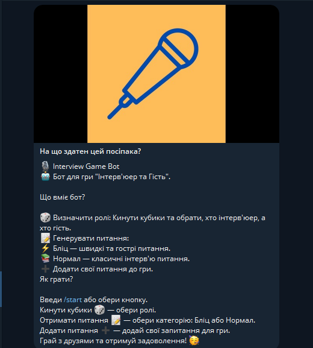

### **Updated README.md**  

Here's the updated content for your `README.md` file, with the newly added screenshots for better clarity and a visual guide.

---

# 🎙️ Interview Game Bot  

**Interview Game Bot** – це бот для гри в інтерв'юерів і гостей у Telegram. Використовуйте його для веселих і корисних інтерактивних ігор, підготовки до співбесід або просто дружніх розмов!  

---

## 📋 **Що вміє бот?**  

1. 🎲 **Визначати ролі**:  
   Киньте кубики, щоб випадково обрати, хто буде **Інтерв'юером**, а хто **Гостем**.  

     

2. 📝 **Генерувати питання**:  
   Отримайте 10 випадкових запитань у двох категоріях:  
   - ⚡ **Бліц**: Швидкі та гострі запитання.  
   - 📚 **Нормал**: Класичні інтерв'ю питання.  

     

3. ➕ **Додавати свої запитання**:  
   Розширте гру, додавши власні запитання до обраної категорії.  

4. 🕹️ **Зручне меню з кнопками**:  
   Усі команди доступні через інтерактивне меню:  
   - **Отримати питання**  
   - **Додати питання**  
   - **Бліц**  
   - **Нормал**  
   - **Кинути кубики**  

     

5. 🔄 **Перемикання категорій**:  
   Легко перемикайтесь між категоріями питань за допомогою кнопок.  

     

---

## 🛠️ **Як користуватися ботом?**  

1. **Запуск бота**  
   Введіть `/start` або використовуйте кнопки для навігації.  
     

2. **Вибір ролей**  
   Натисніть **"Кинути кубики"** та введіть імена двох гравців. Бот визначить ролі автоматично!  

3. **Отримання питань**  
   Оберіть категорію **"Бліц"** або **"Нормал"**, щоб отримати 10 унікальних запитань.  

4. **Додавання питань**  
   Натисніть **"Додати питання"** і введіть своє запитання.  

---

## 🚀 **Команди**  

| **Команда**             | **Опис**                                 |  
|-------------------------|-----------------------------------------|  
| **/start**              | Запускає бота та відображає меню.       |  
| **/question**           | Генерує 10 випадкових запитань.         |  
| **/category <normal|blitz>** | Змінює категорію питань.         |  
| **/add_question <текст>** | Додає ваше запитання до гри.          |  
| **/set_roles**          | Кидає кубики для визначення ролей.      |  

---

## 🎨 **Скріншоти**  

1. **Про бота**  
     

2. **Головне меню**  
     

3. **Вибір гравців (кидання кубиків)**  
     

4. **Генерація запитань**  
     

5. **Перемикання категорій**  
     

---

## 🤝 **Для кого підходить?**  

- **HR-фахівцям** для підготовки до співбесід.  
- **Командам** для тімбілдингу.  
- **Друзям** для веселих ігор і розмов.  

---

**Interview Game Bot** — це ваш новий помічник для веселих та корисних ігор! 🎉  

---

Збережи цей текст як `README.md` і додай файли зображень у папку `img`. Готово! 🚀